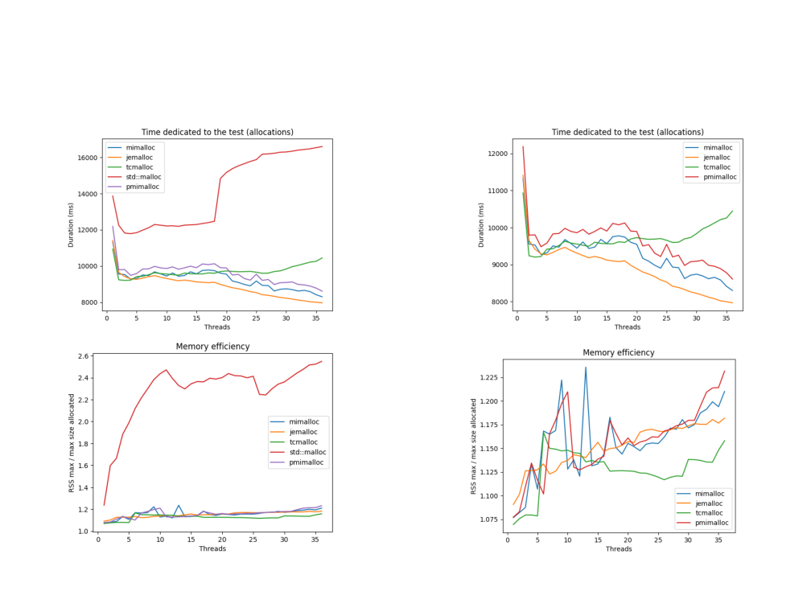

# pmimalloc

[](https://github.com/ncthcn/pmimalloc/actions/workflows/ci.yml)
[](LICENSE)

A composable C++ memory allocator for HPC that unifies fast multithreaded host
allocation (mimalloc arenas) with memory pinning, host/device (GPU) mirroring, and
RDMA memory registration and key exchange.

Allocation-heavy HPC codes that talk to the network or a GPU need memory that is
pinned, registered with the NIC, and sometimes mirrored on the device — properties
usually bolted on with separate, ad-hoc code paths. pmimalloc composes them as
orthogonal compile-time layers around a preallocated arena, so pinning and
registration are paid once per arena instead of once per allocation, and the hot
allocation path stays as fast as a general-purpose allocator.

## Key results

In a multithreaded allocation benchmark (1–36 threads), pmimalloc matches
production general-purpose allocators — [mimalloc](https://github.com/microsoft/mimalloc),
[jemalloc](https://github.com/jemalloc/jemalloc), [tcmalloc](https://github.com/google/tcmalloc) —
on both throughput and memory overhead, while adding the pinning / registration /
mirroring capabilities they lack:



- **Allocation time** (top row, lower is better): `std::malloc` is the clear
  outlier, exceeding 16 000 ms at low thread counts due to global lock contention.
  With it removed (top right), pmimalloc tracks mimalloc and tcmalloc closely
  across all thread counts; jemalloc edges ahead at high thread counts.
- **Memory efficiency** (bottom row, peak RSS / peak bytes requested, lower is
  better): `std::malloc` exceeds 2.5× at high thread counts. pmimalloc clusters
  with mimalloc, jemalloc, and tcmalloc between roughly 1.075 and 1.225 —
  no significant extra overhead from the added layers.

<!-- TODO(nathan): rerun benchmark and record methodology (machine, CPU, allocator
versions, workload) — original run details were not kept. -->

## Quickstart (Linux)

Requires a C++20 compiler, CMake ≥ 3.14, and network access at configure time
(mimalloc is fetched and built from source). On Debian/Ubuntu:

```sh
sudo apt-get install -y libfmt-dev libnuma-dev libhwloc-dev nvidia-cuda-toolkit

cmake -S . -B build -DCMAKE_BUILD_TYPE=Release -DBACKEND=none -DMI_SKIP_COLLECT_ON_EXIT=ON
cmake --build build -j
ctest --test-dir build -R "^test_host" --output-on-failure
```

The CUDA toolkit is required at build time; a physical GPU is only needed at
runtime for mirrored / CUDA-pinned resources. `ctest --test-dir build` without
the filter also runs the mirror tests, which need an NVIDIA GPU. Pinned arenas
`mlock` their full size — raise `ulimit -l` if the pinned tests fail.

## Usage

Compose a resource with the builder, then use it through an STL-compatible
allocator (this is exactly the pattern the tests exercise):

```cpp
#include <pmimalloc/allocator.hpp>

int main()
{
    // mlock-pinned host arena with a mimalloc heap on top
    resource_builder RB;
    auto rb = RB.pin().on_host();
    using resource_t = decltype(rb.build());

    // STL-compatible allocator backed by a 128 MiB arena
    pmimallocator<int, resource_t> alloc(rb, 1ull << 27);

    int* p = alloc.allocate(1);
    *p = 42;
    alloc.deallocate(p);
}
```

Other builder methods: `use_stdmalloc()` (std::pmr pools instead of mimalloc),
`cuda_pin()`, `on_host_and_device()` (mirrored host/device arenas), and
`register_memory()` when built with an RDMA backend — after which
`alloc.get_key(ptr)` returns the remote key/offset for RMA operations.

## Architecture

A resource is a compile-time nest of policy layers; the builder swaps layers by
position and `build(size)` constructs the whole chain:

```
Mirrored -- Resource -- Context -- Pinned -- Memory -- Base
                \           \
             Allocator     Backend
```

- Base: `include/pmimalloc/base.hpp` — address / size / NUMA node
- Memory: `include/pmimalloc/memory.hpp` — host, host+device, user memory
- Pinned: `include/pmimalloc/pinning.hpp` — none, `mlock`, CUDA-pinned
- Context: `include/pmimalloc/context.hpp` — registers memory with a backend
  (libfabric in `src/libfabric/`, UCX scaffolding in `src/ucx/`)
- Resource: `include/pmimalloc/resource.hpp` — attaches the allocator
  (`ext_mimalloc.hpp` arena or `ext_stdmalloc.hpp` std::pmr pools)
- Mirrored: `include/pmimalloc/mirroring.hpp` — host/device pointer translation
  by fixed offset into a device arena of equal size

## Configuration

CMake cache variables:

- `BACKEND` — registration backend: `none` (default), `libfabric` (functional,
  needs libfabric + Boost), `ucx` / `mpi` (scaffolding, not wired into builders)
- `ENABLE_LOGGING` — per-thread buffered logging to stderr (default OFF)
- `MI_SKIP_COLLECT_ON_EXIT` — must be set `ON` (forwarded to the mimalloc build)
- `BUILD_TESTING` — build the test executables (default ON)

## Tests

`test/` contains host and mirror test executables, each in single/multi-thread
and single/multi-arena variants, plus std::pmr-backed variants. Each allocates
from concurrent threads, writes distinct values, and verifies them on readback.
CI builds the library and runs the host tests on every push.

## Status and platforms

Linux only. The libfabric registration backend is functional; UCX has
region/handle scaffolding (`src/ucx/`) usable directly via `rma_region`, but is
not yet wired into the builders. Known limitations: arenas have a fixed size
(they cannot grow), and `mmap`/`mlock` limits cap arena sizes.

## License

MIT — see [LICENSE](LICENSE).
